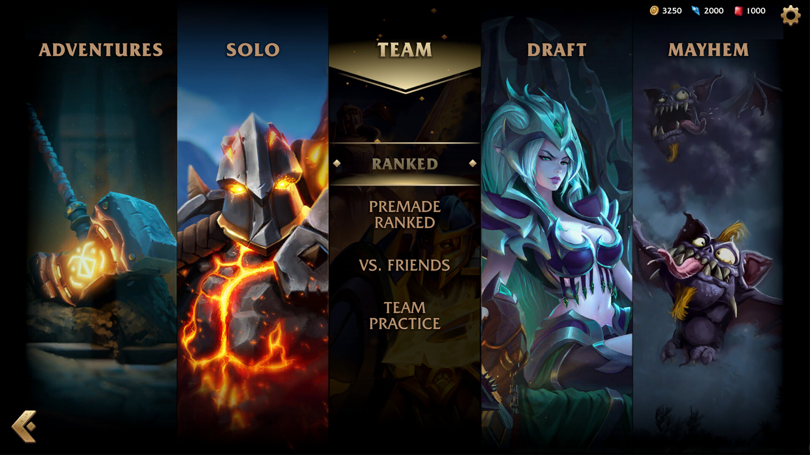

# Ralph Plan - ralph-100-c37

Date: 2026-02-13
Reference Topic: Minion Masters
Graphics Mode: KayKit

## 0. ?œì?/ë©”í?
- 문서 ID: plan-2026-02-13-ralph-100-c37
- 기ì? 지ì¹? docs/ralph/research/naver_planning_style_guide_2026-02-13.md

## 1. 목차
1. 개요
2. 본론
3. 구현 ê°€?¥ì„±
4. QA/검�5. 참고/가??
## 2. 개요
- ?€?? Minion Masters 기반 ì¹´ë“œ ë°°í? 루프 개선
- ë°°ê²½: ?„투 ê°€?…성, 짧ì? ?„투 ?œí™˜, 즉시 ?¼ë“œë°?ê°•í™”ë¥??°ì„  과제ë¡??¤ì •
- 목표: ???¬ì�´????구현 ê°€?¥í•œ ?¨ì�¼ 변경안???•ì�˜?˜ê³  ê²€ì¦?ê°€?¥í•œ ?•íƒœë¡?문서??
## 3. 본론
### 3.1 기íš�???•ì�˜
- ?´ë²ˆ ?¬ì�´?´ì�˜ 주제 ??? ì¢�게 ? ì??œë‹¤.
- ë³€ê²?범위???˜ë‚˜??기능/?”ë©´/?�태 ?�름?¼ë¡œ ?œí•œ?œë‹¤.

### 3.2 ?¬ìš© ?œì �/?™ì�‘ 맥ë�½
- ?„투 ?œì�‘~중반 구간?�ì„œ ?Œë ˆ?´ì–´ê°€ ê°€???�주 보는 ?•ë³´(코스???¸ë“œ/?„ì�¥ ?�태)ë¥??°ì„  개선?œë‹¤.

### 3.3 ?¨ê³„ë³??�름(?”약)
1. 문제 구간 ?�별
2. ?¨ì�¼ 개선???•ì�˜
3. ???¤í�¬ë¦½íŠ¸ ?�ìš©
4. QA 체�

### 3.4 ?ˆí�¼?°ìŠ¤ ?´ë?지(로컬 ë§�í�¬)
1. ?ˆí�¼?°ìŠ¤ ?¤í�¬ë¦°ìƒ·

2. ?ˆí�¼?°ìŠ¤ ?¤í�¬ë¦°ìƒ·

3. ?ˆí�¼?°ìŠ¤ ?¤í�¬ë¦°ìƒ·

4. ?ˆí�¼?°ìŠ¤ ?¤í�¬ë¦°ìƒ·

5. ?ˆí�¼?°ìŠ¤ ?¤í�¬ë¦°ìƒ·

6. ?ˆí�¼?°ìŠ¤ ?¤í�¬ë¦°ìƒ·

7. ?ˆí�¼?°ìŠ¤ ?¤í�¬ë¦°ìƒ·

8. ?ˆí�¼?°ìŠ¤ ?¤í�¬ë¦°ìƒ·

### 3.5 ?µì‹¬ ?¬ë? ?¬ì�¸??(??문ì�¥)
- 짧ì? ?�단-?¤í–‰-ê²°ê³¼ 루프ë¥?ê°•í™”?? ì¹´ë“œ ?¬ìš© ì§�후 ?„황 ë³€?”ê? 즉시 ì²´ê°�?˜ê²Œ ?œë‹¤.

## 4. 구현 ê°€?¥ì„±
- ?ˆìƒ� ?�í–¥ 경로: scenes/battle, scenes/ui, scripts/card_battle, scripts/ui
- ?°ì�´??ë³€ê²??„ìš” ??CSV ?�는 .tresë¡?추ì � ê°€?¥í•˜ê²?기ë¡�
- ?‘ì—… ì²´í�¬: UI/?„트 변경ì�´ ?¬í•¨?˜ë©´ 리소??경로?€ 버전 규칙???¨ê»˜ 명시

## 5. QA/검�계�
1. ?•ì � QA: tools/qa_card_battle_static_checks.ps1
2. ?¤ë“œë¦¬ìŠ¤: tools/run_godot_safe.ps1 -Mode headless
3. ?˜ë�™ ê²€ì¦? ?˜ì •????1???´ìƒ� ?¤í–‰ ??기ë? ê²°ê³¼ ?•ì�¸

?©ê²© 기ì?:
- parse/startup ?¤ë¥˜ ?†ì�Œ
- ?µì‹¬ ë³€ê²??™ì�‘ ?¬í˜„ ê°€??- 문서 ??근거/ê°€???¤ì�Œ ?¡ì…˜ ?„ë�½ ?†ì�Œ

## 6. 참고/가??- Steam store: https://store.steampowered.com/app/489520/Minion_Masters/
- Reference README: docs\ralph\reference\minion-masters\README.md
- ê°€?? ë³??¬ì�´?´ì? 구현 ê°€?¥í•œ ?¨ì�¼ 주제 기ì??¼ë¡œ 진행
